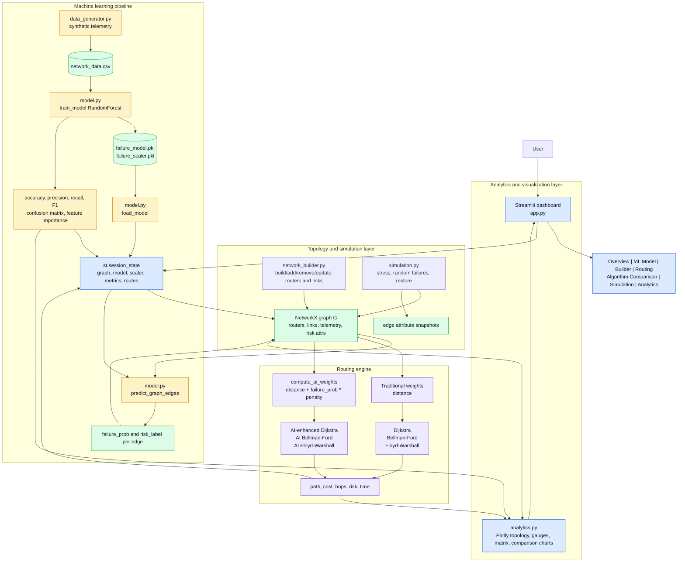

# 🌐 AI-Based Network Route Optimizer

> An engineering project combining **Design & Analysis of Algorithms** with **Machine Learning** — built as a fully interactive Streamlit dashboard for real-time network topology visualization, intelligent routing, and failure-aware traffic simulation.

---

## 📌 Project Overview

Modern networks face constant challenges: link failures, traffic surges, and unpredictable latency spikes. Traditional routing algorithms like Dijkstra operate purely on static weights — they have no awareness of *risk*. This project bridges that gap.

The **AI-Based Network Route Optimizer** trains a Random Forest classifier on synthetic network telemetry data to predict the probability of link failure in real time. That failure probability is then fed into an **AI-Enhanced Dijkstra** algorithm, dynamically re-weighting edges to steer traffic away from high-risk paths — before failures even occur.

The result is a side-by-side comparison of traditional vs. AI-enhanced routing, stress-testing tools, and a live interactive topology map — all inside a seven-tab Streamlit dashboard.

---

## Architecture Diagram



The Streamlit app keeps the active graph, trained model, scaler, metrics, and route results in session state. The ML pipeline annotates every NetworkX edge with failure probability and risk labels, then the routing layer compares distance-only paths against AI-penalized paths before Plotly renders the dashboard.

---

## 🎯 Key Features

- **Live network topology** — colour-coded edges visualize link risk (green → yellow → red) in real time
- **Dual routing engine** — run standard Dijkstra and AI-Enhanced Dijkstra on the same graph simultaneously and compare path cost, hop count, and risk score
- **Random Forest failure predictor** — trained on 800 rows of synthetic telemetry (bandwidth, latency, packet loss, jitter, uptime) to score each link's failure probability
- **Traffic & latency stress simulation** — configurable multipliers inject realistic load; random failure injection tests network resilience
- **Dynamic graph builder** — add/remove routers and links on the fly without restarting the app
- **Analytics dashboard** — confusion matrix, feature importance chart, per-route risk comparison plots, all rendered with Plotly

---

## 🧠 Core Concepts

### AI-Enhanced Weight Formula

The key insight behind this project is a single sole formula that combines physical distance with predicted risk:

```
ai_weight = distance + (failure_probability × penalty_factor)
```

- **`distance`** — base link cost (latency, hop count, or physical distance)
- **`failure_probability`** — output of the Random Forest model (0.0 → 1.0)
- **`penalty_factor`** — tunable slider in the UI; higher values make the algorithm more aggressively avoid risky links

When `penalty_factor = 0`, AI-Enhanced Dijkstra degenerates to standard Dijkstra. As the penalty increases, the algorithm increasingly favours longer-but-safer paths over shorter-but-risky ones.

### Why Random Forest?

Random Forest was chosen over simpler classifiers (Logistic Regression, Naive Bayes) for several reasons:

- **Non-linearity** — link failure is rarely a linear function of a single metric; RF captures feature interactions (e.g. high latency *combined with* high packet loss is far riskier than either alone)
- **Feature importance** — RF naturally ranks which telemetry signals matter most, giving interpretable insight
- **Robustness** — ensemble averaging reduces overfitting on noisy network data
- **No scaling required** — unlike SVM or KNN, RF handles mixed feature magnitudes without normalization

---

## ⚙️ Algorithm Complexity

| Algorithm | Time Complexity | Space Complexity | Notes |
|---|---|---|---|
| Standard Dijkstra | O((V + E) log V) | O(V + E) | Min-heap priority queue |
| AI-Enhanced Dijkstra | O((V + E) log V) | O(V + E) | Same structure; weight function differs |
| RF Training | O(n · d · k · log n) | O(k · d) | n=samples, d=depth, k=trees |
| RF Inference | O(k · log n) | O(k) | Per-link, runs at routing time |
| K-Means (topology init) | O(i · n · k) | O(n + k) | i=iterations |

> V = routers, E = links, k = trees, n = training samples, d = max tree depth

Both routing variants share identical worst-case complexity — the AI enhancement adds **zero asymptotic overhead**. The only runtime cost is RF inference per edge, which is negligible (microseconds per link).

---

## 🗂️ Project Structure

```
ai-based-network-route-optimizer/
│
├── app.py                  # Streamlit entry point — 7 fully functional tabs
├── model.py                # RandomForest training, inference, and evaluation
├── routing.py              # Standard Dijkstra + AI-Enhanced Dijkstra
├── network_builder.py      # NetworkX graph CRUD (add/remove nodes & edges)
├── simulation.py           # Traffic/latency stress multipliers + random failure injection
├── analytics.py            # All Plotly chart builders (confusion matrix, feature importance, etc.)
├── data_generator.py       # Synthetic 800-row training dataset generator
├── utils.py                # Colour maps, shared constants, helper functions
├── network_data.csv        # Pre-generated dataset (ready to use without regenerating)
├── failure_model.pkl       # Trained RandomForest model (saved after first training run)
├── failure_scaler.pkl      # Feature scaler for inference (saved alongside model)
└── requirements.txt        # Python dependencies
```

---

## 🚀 Quick Start

### Prerequisites

- Python 3.9+
- pip

### Install

Create and activate a virtual environment:

```bash
python -m venv venv
```

Windows PowerShell:

```powershell
Set-ExecutionPolicy -Scope Process -ExecutionPolicy RemoteSigned
.\venv\Scripts\Activate.ps1
```

macOS / Linux:

```bash
source venv/bin/activate
```

Install dependencies:

```bash
pip install -r requirements.txt
```

### Launch

```bash
streamlit run app.py
```

Open **http://localhost:8501** in your browser.

---

## 🖥️ Usage Flow

The dashboard is easiest to explore in this order on a first run:

| Step | Tab | What to do | What to observe |
|---|---|---|---|
| 1 | ML Model | Click **"Generate Data & Train Model"** once. | The dataset, model, scaler, and evaluation metrics are created for the session. |
| 2 | Overview | Inspect the live topology map. | Edge colours show safe, moderate, and high-risk links. |
| 3 | Routing | Choose source/destination routers and click **"Find Routes"**. | Standard and AI-enhanced routes appear side by side with cost, hops, and risk. |
| 4 | Simulation | Increase traffic/latency multipliers or inject a random failure. | Risk scores and route choices shift as link conditions degrade. |
| 5 | Builder | Add, remove, or update routers and links. | The graph changes immediately without restarting the app. |
| 6 | Analytics | Review confusion matrix, feature importance, and route comparisons. | Model behavior and routing trade-offs become easier to explain. |

---

## 📊 Machine Learning Pipeline

### Dataset (`network_data.csv`)

800 rows of synthetic network telemetry, generated by `data_generator.py`:

| Feature | Description |
|---|---|
| `bandwidth_utilization` | Link load as a percentage (0–100) |
| `latency_ms` | Current round-trip latency in milliseconds |
| `packet_loss_rate` | Packet loss as a percentage (0–1) |
| `jitter_ms` | Latency variance in milliseconds |
| `uptime_hours` | Hours since last link reset |
| `link_distance` | Physical or logical distance weight |
| `failure` | Binary label — 0 (stable) or 1 (at-risk) |

### Training (`model.py`)

1. Load `network_data.csv`
2. Standard train/test split (80/20)
3. Feature scaling via `StandardScaler`
4. Fit `RandomForestClassifier(n_estimators=100, random_state=42)`
5. Evaluate: accuracy, precision, recall, F1, confusion matrix
6. Serialize model and scaler to `.pkl` files

### Inference (at routing time)

For each link in the graph, the current telemetry values are assembled into a feature vector, passed through the loaded scaler, and then through the RF model to produce a `failure_probability` in [0, 1]. This value is used directly in the AI-Enhanced weight formula.

---

## 🔬 Design & Analysis of Algorithms — Connection

This project was built as a DAA capstone. The algorithmic content covers:

- **Graph representation** — NetworkX adjacency lists; discussed trade-offs vs. adjacency matrix for sparse vs. dense topologies
- **Shortest path** — Dijkstra with a min-heap (priority queue), proven O((V+E) log V)
- **Greedy strategy** — both Dijkstra variants are greedy algorithms; the AI variant modifies the cost function but preserves the greedy selection property
- **Ensemble methods** — Random Forest as a bagging ensemble; bias-variance decomposition discussed in the analytics tab
- **Clustering** — K-Means used for initializing synthetic node positions in the generator; inertia tracked across k values

---

## 📦 Dependencies

```
streamlit
networkx
scikit-learn
pandas
numpy
plotly
matplotlib
```

All pinned in `requirements.txt`.

---

## 🛠️ Extending the Project

Some natural extensions explored or planned:

- **Real telemetry** — replace the synthetic generator with SNMP polling or a NetFlow collector
- **OSPF comparison** — add a third routing variant using link-state advertisement weights
- **Temporal modelling** — use an LSTM on time-series link metrics instead of a static RF classifier
- **Multi-path routing** — k-shortest-paths with load balancing across the top-3 AI-ranked routes
- **REST API** — expose routing decisions via FastAPI so external systems can query optimal paths

---
