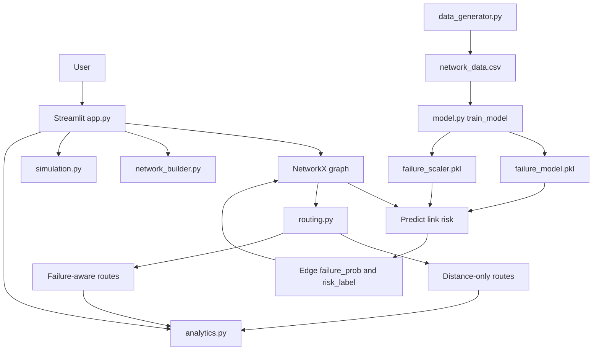

# AI-Based Network Route Optimizer

A Streamlit dashboard for comparing traditional shortest-path routing with
machine-learning assisted, failure-aware routing. The project combines graph
algorithms, synthetic network telemetry, Random Forest failure prediction, stress
simulation, and Plotly analytics in one interactive application.

## Overview

Modern network routes are usually selected from static edge weights such as
distance or latency. That works when the network is healthy, but it does not
account for links that are overloaded, lossy, or likely to fail soon.

This project adds a prediction layer on top of classical routing. A Random
Forest model estimates the failure probability of each network link from live
link attributes, and the routing engine uses that probability to penalize risky
edges before selecting a path.

```text
ai_weight = distance + (failure_probability * penalty_factor)
```

When the penalty factor is low, routing behaves like standard shortest-path
routing. As the penalty increases, the optimizer prefers safer routes even when
they are longer.

## Key Features

- Interactive Streamlit dashboard with seven tabs: Overview, ML Model, Builder,
  Routing, Algorithm Comparison, Simulation, and Analytics.
- NetworkX topology builder for adding, removing, and updating routers and
  links without restarting the app.
- Random Forest link-failure predictor trained on synthetic telemetry:
  bandwidth, latency, packet loss, and traffic load.
- Failure-aware routing for Dijkstra, Bellman-Ford, and Floyd-Warshall using the
  same AI-weighting strategy.
- Stress simulation for traffic load, latency, packet loss, and random link
  failures.
- Plotly visualizations for topology, route comparison, model metrics, feature
  importance, risk distribution, and network health.
- Lightweight regression tests for failed-link routing and simulation restore
  behavior.

## Project Contributions

These are the main contributions this repository highlights on GitHub:

1. Built an AI-enhanced edge-weighting layer that combines physical distance
   with predicted link-failure probability.
2. Added side-by-side comparison of traditional and AI-enhanced routing across
   Dijkstra, Bellman-Ford, and Floyd-Warshall.
3. Created an interactive topology builder for live graph mutation through the
   Streamlit interface.
4. Implemented traffic, latency, packet-loss, and random-failure simulation to
   test routing resilience.
5. Added analytics views for model performance, feature importance, route risk,
   and network health.

## Repository Highlights

- `app.py` ties the graph, model, simulation controls, and analytics into one
  Streamlit workflow.
- `routing.py` keeps traditional and AI-enhanced path calculations comparable by
  using the same graph state with different edge weights.
- `tests/test_routing_simulation.py` protects the failure-handling behavior that
  matters most for demos and regressions.

## Architecture



## How It Works

1. `data_generator.py` creates synthetic telemetry records with a binary
   `failure` label.
2. `model.py` trains a `RandomForestClassifier` and saves the model and scaler.
3. `network_builder.py` creates the default router topology and supports graph
   edits from the dashboard.
4. `model.py` annotates each edge with `failure_prob` and `risk_label`.
5. `routing.py` computes traditional and AI-enhanced paths.
6. `simulation.py` mutates link conditions to test degraded-network behavior.
7. `analytics.py` renders the topology, comparisons, and health charts.

## Algorithms

| Algorithm | Weight Used | Time Complexity | Purpose |
|---|---|---:|---|
| Dijkstra | `distance` | `O((V + E) log V)` | Fast shortest path on non-negative weights |
| AI Dijkstra | `ai_weight` | `O((V + E) log V)` | Fast failure-aware shortest path |
| Bellman-Ford | `distance` | `O(VE)` | Single-source shortest path comparison |
| AI Bellman-Ford | `ai_weight` | `O(VE)` | Failure-aware single-source comparison |
| Floyd-Warshall | `distance` | `O(V^3)` | All-pairs routing table style comparison |
| AI Floyd-Warshall | `ai_weight` | `O(V^3)` | Failure-aware all-pairs comparison |

## Project Structure

```text
AI-Based-Network-Route-Optimizer/
|-- app.py                         # Streamlit dashboard entry point
|-- analytics.py                   # Plotly chart builders
|-- data_generator.py              # Synthetic network telemetry generator
|-- model.py                       # Training, loading, and link prediction
|-- network_builder.py             # NetworkX topology creation and mutation
|-- routing.py                     # Traditional and AI-enhanced routing
|-- simulation.py                  # Stress tests, failures, and restore logic
|-- utils.py                       # Shared constants and helper functions
|-- network_data.csv               # Pre-generated training dataset
|-- failure_model.pkl              # Saved Random Forest model
|-- failure_scaler.pkl             # Saved feature scaler
|-- requirements.txt               # Python dependencies
`-- tests/
    `-- test_routing_simulation.py # Regression tests
```

## Quick Start

### Prerequisites

- Python 3.9 or newer
- pip
- A terminal that can run Streamlit locally

### 1. Create a virtual environment

```bash
python -m venv venv
```

Windows PowerShell:

```powershell
.\venv\Scripts\Activate.ps1
```

macOS or Linux:

```bash
source venv/bin/activate
```

### 2. Install dependencies

```bash
pip install -r requirements.txt
```

### 3. Run the dashboard

```bash
streamlit run app.py
```

Open the local URL shown by Streamlit, usually:

```text
http://localhost:8501
```

### 4. Run tests

```bash
python -m unittest discover -s tests
```

## Troubleshooting

- If Streamlit cannot find a package, confirm the virtual environment is active
  and rerun `pip install -r requirements.txt`.
- If the dashboard opens with empty model metrics, go to the ML Model tab and
  train the model once.
- If port `8501` is already busy, run `streamlit run app.py --server.port 8502`
  and open the URL printed in the terminal.

## Recommended Demo Flow

1. Open the ML Model tab and train the model.
2. Inspect the default topology in the Overview tab.
3. Choose a source and destination in the Routing tab.
4. Compare traditional and AI-enhanced paths.
5. Use the Simulation tab to increase traffic, latency, packet loss, or failed
   links.
6. Re-run routing and observe how the AI-weighted path changes.
7. Review the Analytics tab for route risk, feature importance, and health
   summaries.

## Dashboard Tabs

| Tab | What it helps with |
|---|---|
| Overview | Inspect the current topology and high-level network state. |
| ML Model | Generate data, train the model, and review evaluation metrics. |
| Builder | Add, update, or remove routers and links interactively. |
| Routing | Compare selected source-destination paths. |
| Algorithm Comparison | Review traditional and AI-enhanced algorithm behavior side by side. |
| Simulation | Apply stress conditions and random failures. |
| Analytics | Explore route risk, feature importance, and health charts. |

## Dataset

The included `network_data.csv` contains synthetic link telemetry generated from
four features:

| Feature | Description |
|---|---|
| `bandwidth` | Link bandwidth in Mbps |
| `latency` | Link latency in milliseconds |
| `packet_loss` | Packet loss percentage |
| `traffic_load` | Current utilization percentage |
| `failure` | Binary target label, where `1` means at-risk |

The data is generated with a stress score that increases when bandwidth is low
or latency, packet loss, and traffic load are high.

## Model

`model.py` trains a `RandomForestClassifier` with:

- 150 trees
- max depth of 8
- balanced class weights
- 80/20 train-test split
- `StandardScaler` preprocessing

The dashboard reports accuracy, precision, recall, F1 score, confusion matrix,
classification report, and feature importance.

## Testing Notes

Current tests cover:

- Failed links are excluded from traditional and AI routes.
- Random failure injection only selects active links.
- Simulation restore removes stale edge attributes and restores saved values.

Run them before pushing changes:

```bash
python -m unittest discover -s tests
```

## Future Improvements

- Replace synthetic data with real telemetry from SNMP, NetFlow, or router logs.
- Add k-shortest paths for load-balanced route recommendations.
- Add REST API endpoints for external route queries.
- Store simulation scenarios for repeatable experiments.
- Add exportable route reports for demonstrations and project submissions.

## License

This repository is intended for academic and portfolio use. Add a license file
before using it in a production or commercial environment.
